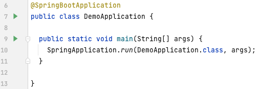

## Simple Docker Demo using Springboot
A simple springboot app that allows you to submit a form and view the form. This app uses MySQL as database and PHPMyAdmin as web-based database viewer. Both MySQL and PHPMyAdmin are from public docker images. This demo shows several docker features such as manually entered docker commands on terminal,````docker-compose````, ```Dockerfile```, and ```docker volume```.

https://user-images.githubusercontent.com/52971362/209032223-cc35cc6d-2491-4d1f-9381-b2a191742653.mov


## How to run the app:
- Run MySQL and PHPMyAdmin by running ```docker-compose -f docker-compose.yaml up```
- Go to ```DemoApplication.java``` and click the green triangle button next to the ```DemoApplication``` class

